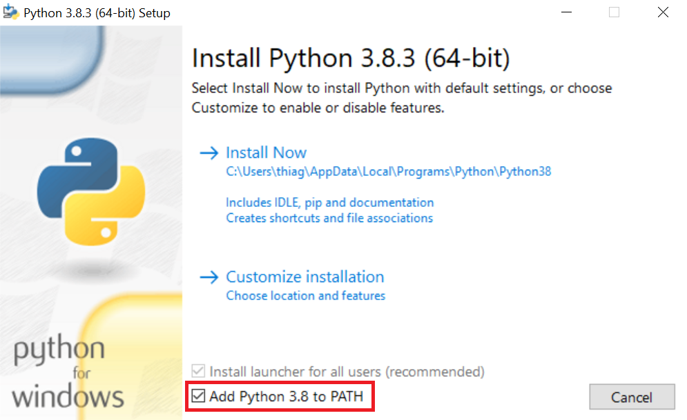

# IRPF CEI

[](https://github.com/staticdev/irpf-cei/actions?workflow=Tests)
[](https://pypi.python.org/pypi/irpf-cei)
[](https://codecov.io/gh/staticdev/irpf-cei)

[](https://github.com/psf/black)
[](https://github.com/pre-commit/pre-commit)

Programa auxiliar para calcular custos de ações, ETFs e FIIs. Este programa foi feito para calcular emolumentos, taxa de liquidação e custo total para a declaração de Bens e Direitos do Imposto de Renda Pessoa Física.

**Essa aplicação foi testada e configurada para calcular tarifas referentes ao ano de 2019-2020 (IRPF 2020) e não faz cálculos para compra e venda no mesmo dia (Day Trade), contratos futuros e Índice Brasil 50.**

## Requisitos

1. Python

Instale na sua máquina o Python 3.8.0 ou superior para o seu sistema operacional em http://python.org.

Usuários do Windows devem baixar a versão `Windows x86-64 executable installer` e na tela de instalação marcar a opção `Add Python 3.8 to PATH`:



2. Suporte a língua Português (Brasil) no seu sistema operacional.

Pode ser instalado no Linux (Debian/Ubuntu) pelo comando:

```sh
apt-get install language-pack-pt-base
```

## Instalação

Você pode instalar o _Irpf Cei_ via [pip](https://pip.pypa.io/) pelo [PyPI](https://pypi.org/):

```sh
pip install irpf-cei
```

Nota: no Windows você pode digitar o comando acima pelo programa `cmd`.

## Uso

1. Entre no [site do CEI](https://cei.b3.com.br/), faça login e entre no menu Extratos e Informativos → Negociação de Ativos → Escolha uma corretora e as datas 1 de Janeiro e 31 de Dezembro do ano em que deseja declarar. Em seguida clique no botão “Exportar para EXCEL”. Ele irá baixar o arquivo “InfoCEI.xls”.
2. Execute o programa através do comando:

```sh
irpf-cei
```

O programa irá procurar o arquivo "InfoCEI.xls" na pasta atual (digite `pwd` no terminal para sabe qual é) ou na pasta downloads e exibirá na tela os resultados.

Ao executar, o programa pede para selecionar operações realizadas em leilão. Essa informação não pode ser obtida nos relatórios do CEI e precisam ser buscadas diretamente com a sua corretora de valores. Isso afeta o cálculo dos emolumentos e do custo médio.

## Aviso legal (disclaimer)

Esta é uma ferramenta com código aberto e gratuita, com licença MIT. Você pode alterar o código e distribuir, usar comercialmente como bem entender. Contribuições são muito bem vindas. Toda a responsabilidade de conferência dos valores e do envio dessas informações à Receita Federal é do usuário. Os desenvolvedores e colaboradores desse programa não se responsabilizam por quaisquer incorreções nos cálculos e lançamentos gerados.
